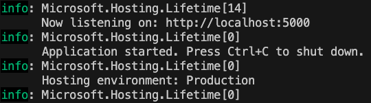

# Chirp
## Analysis, Design and Software Architecture (Autumn 2024)
##### *Group 13*

Authors
> Alexander Hvalsøe Holst <alhh@itu.dk>
> Andreas Løvsgren Nielsen <anln@itu.dk>
> André Racraquin Birk <arbi@itu.dk>
> Peter Aksel Skak Olufsen <polu@itu.dk>
> Símun Larsson Løkke Rasmussen <simra@itu.dk>

___

### How to start the project on localhost

1. Ensure you have all the ***.Net 8*** dependencies installed [here](https://dotnet.microsoft.com/en-us/download/dotnet/8.0).  

2. Download the newest release for your operating system [here](https://github.com/ITU-BDSA2024-GROUP13/Chirp/releases).  

3. Unzip the file, and navigate to the folder.  

4. Run `$ dotnet Chirp.Web.dll `  

5. Look in your terminal for which port the project is listening on. e.g.  

6. Open your browser and type `http://localhost:<port>`  
