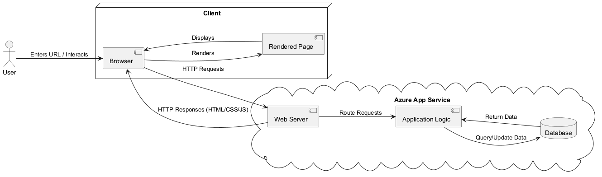

<!-- Illustrate the architecture of your deployed application. Remember, you developed a client-server application. Illustrate the server component and to where it is deployed, illustrate a client component, and show how these communicate with each other. -->

\
This diagram illustrates the *architecture of the Chirp application* as well as the interaction between its key components. The system is divided into three main layers: *the Client, the Server, and the Database*, all hosted within the *Azure* environment.

- **Client Layer**: The user interacts with the application using a web browser. When the user enters a `URL` or performs an action, the browser sends `HTTP` requests to the server. The browser receives responses in the form of `HTML`, `CSS`, and `JavaScript`, which it uses to render and display the user interface.  

- **Server Layer**: Hosted on the *Azure App Service*, the server is made up of two primary components: *the Web Server* and *the Application Logic*. The web server handles incoming `HTTP` requests from the *client* and *routes* them to the appropriate *application logic*. This logic processes the request and then queries the database for data or updates if necessary.  

- **Database Layer**: The database is integrated into the *Azure* ecosystem and stores all the application data. This includes user information, *Cheeps*, and *relationships*. It responds to queries from the application logic with the requested data or confirms successful updates.

The flow begins when a user interacts with the browser (e.g., entering a `URL`). The browser sends a request to the *web server*, which processes the request and interacts with the *application logic*.
The database returns the required information, which is processed and formatted by the *application logic* and *web server* before being sent back to the client as an `HTTP` response. The browser then renders the returned content and updates the *user interface* accordingly.