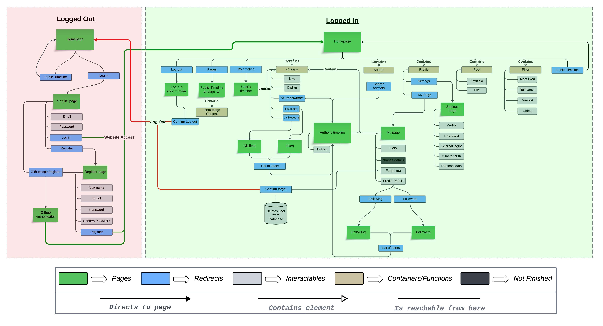

% Illustrate typical scenarios of a user journey through your Chirp! application. That is, start illustrating the first page that is presented to a non-authorized user, illustrate what a non-authorized user can do with your Chirp! application, and finally illustrate what a user can do after authentication.

% Make sure that the illustrations are in line with the actual behavior of your application.

# Useractivity 
When it comes to webdevelopment, the overall userexperience and functionality of the website is crucial. The importance of ensuring that the website strcuture and functionality aren't confusing, and works as a user intends for them to work cannot be overstated. Giving the user accessibilites of these functions while also maintaining the safety of a website, can end up being one of the more important aspects of webdevelopment.

The sitemap on figure 1*, contains all/most of the traversal possibilities for a user - logged in & logged out - to illustrate both the user's accessibility in different parts of the website and the general structure of the website.

    <b>Figure 1: sitemap</b>

### Logged out
*When a user is logged out, they do not have the same access as a user who is logged in. The access is very limited, and it only goes as far as to actually log in or register as a new user. The user can choose two alternatives, which are explained below.* *Any references to the websites structure, will be directed towards the illustration in figure 1.1 which is just a "closeup" of a part in figure 1.*

    <b>Figure 1.1: Logged out</b>

#### Github login/register
When a user enters the website, they will be met by the front page, however without content. To access the content, the user must press the "Log in" button, which will lead them to the "Log in"-page. From here the user might choose to use an external login to access the website. By using the external login 

#### Normal register/login

### Logged in
#### Main page
##### Post & Search
##### Filter
##### My Timeline

#### Profile
##### My Page
##### Settings