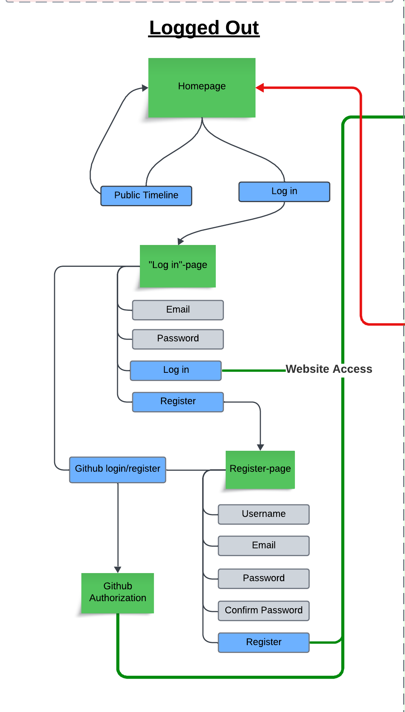

<!-- % Illustrate typical scenarios of a user journey through your Chirp! application. That is, start illustrating the first page that is presented to a non-authorized user, illustrate what a non-authorized user can do with your Chirp! application, and finally illustrate what a user can do after authentication.

% Make sure that the illustrations are in line with the actual behavior of your application. -->

# Useractivity 
When it comes to webdevelopment, the overall userexperience and functionality of the website is crucial. Giving the user access to the functions of the website while also maintaining the safety of the website, can end up being one of the more important aspects of webdevelopment.

The sitemap in figure 1, contains most of the traversal possibilities for a user, when logged in and logged out, to illustrate the user's accessibility in different parts of the website and the general structure of the website.

    <b>Figure 1: sitemap</b>

### Logged out
When a user is logged out, they do not have the same access as a user who is logged in. The access is very limited, and it only allows the user to log in or register as a new user. The user can choose two alternatives, which are explained below. Any references to the websites structure, will be directed towards the illustration in figure 1.1.

    <b>Figure 1.1: Logged out</b>

#### Github login/register
When a user enters the website, they will see the front page without content. To access any content, the user must press the "Log in" button, which will lead them to the "Log in"-page. From here the user can choose to use an external login to access the website. The external login uses the GitHub Authorization process giving the website a token, which allows the website to access the information about the github user. 

If the user exists within the database, the user is logged in and is now able to access the application with all of its functionalities. If a user does not exist, the user's "Github User ID" becomes the username and they are registered as a new user.

#### Normal login/register
As shown in figure 1.1 to log in to the website, a user must write their email and password of their account. If they do not exist in the database, an error message will be sent back to inform the user that the log in process has failed. If it succeeds, the user will be given access.

However if a user does not have an account, the user can access the register-page, where the user is asked to enter their desired email, username and password. If the information (username and email) does not already exist within the database, the user will be registered as a new user and be given access. If the information already exists, the person will be given an error message, informing the user, that the information is already in use.

### Logged in
When a user is logged in, they have full accessibility to the website, which includes both functions and content. Most of the interactability is present on the front page. References to the websites structure in this section, will be directed towards the illustration in figure 1.2

    <b>Figure 1.2: Logged in</b>

#### Main page
##### Cheeps
As seen in figure 1.2 under "Cheeps" a user can read and then like or dislike a cheep.
From the cheep, a user can access the author's page and timeline as well as see who liked or disliked the cheep.
##### My Timeline
The user's timeline displays the users own cheeps, and the cheeps posted by who they follow.
##### Post and Search
The search function searches the database for authors. When searching, the user is presented with a textfield, which will find possible search results for any given author which matches the content of the search-bar. The results of authors that are returned can be clicked, which redirects to the author's timeline. 

The post function as seen in figure 1.2 has two elements; a textfield and a file button. The textfield can be filled out by the user. The file button, allows the user to choose a picture from their own computer, which will then be included in their cheep, along with the text.

##### Filter
As seen in figure 1.2 a user can choose to check out popular cheeps by pressing the option *MostLiked*. This filters the cheeps in a descending order with the most liked cheep being at the top. Other options such as *Newest* or *Oldest* will order the cheeps based on time. The *Relevance* option in the filter will give you a order based on time, however the cheeps shown, will be *relevant* - which shows cheeps from the user's following and like cheeps.

#### Profile
To explore the user's account and their own information, the user can click on their profile picture. This displays a new page with the user's *My Page* and *Settings*. References to the websites structure in this section, will be directed towards the illustration in figure 1.3

    <b>Figure 1.3: Profile</b>

##### My Page
The *My Page* element, when accessing the profile, redirects the user to the user's *My Page*. Within this page is most of the relevant information of the user, such as email, username and the amount of followers and amount of people that the user follows. The user can access a page with a list for all the users that they follow, and a list of all the users that follow them. Moreover, the *My Page* also has other functionalities and information, such as the *Forget Me* option, which the user can choose, when looking at the overall sitemap in figure 1, to delete all their information. The *Help* includes a basic guide on how to use the Chirp website.
 
##### Settings
The *Settings* button allows the user to see a more detailed view of their account information.
By looking at figure 1.3 the *Settings* page contains more options than the user's *My Page*.
By looking at the profile the user can look at their account's username, but also register a telephone number. Other elements such as *Password*, gives the user the ability to change their password. 
If the user wanted to link an external login to their user, they can navigate to *External Logins* where they are able to link their github account to their Chirp account.
If the user wishes additional safety measures for their account, they can navigate to the 2-factor authentication, which will allow the user to link an authentication app.
The *Personal Data* allows the user to download their data from the Chirp website.

