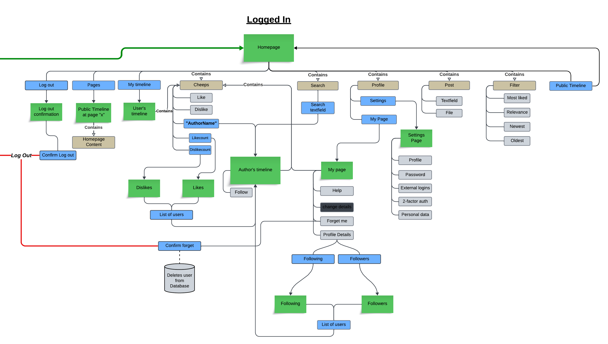
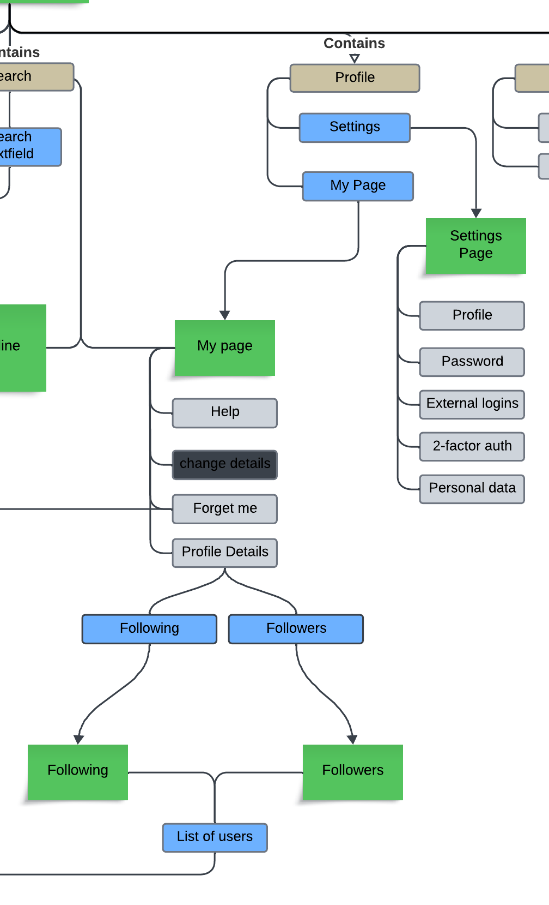

% Illustrate typical scenarios of a user journey through your Chirp! application. That is, start illustrating the first page that is presented to a non-authorized user, illustrate what a non-authorized user can do with your Chirp! application, and finally illustrate what a user can do after authentication.

% Make sure that the illustrations are in line with the actual behavior of your application.

# Useractivity 
When it comes to webdevelopment, the overall userexperience and functionality of the website is crucial. The importance of ensuring that the website strcuture and functionality aren't confusing, and works as a user intends for them to work cannot be overstated. Giving the user accessibilites of these functions while also maintaining the safety of a website, can end up being one of the more important aspects of webdevelopment.

The sitemap on figure 1*, contains all/most of the traversal possibilities for a user - logged in & logged out - to illustrate both the user's accessibility in different parts of the website and the general structure of the website.

    <b>Figure 1: sitemap</b>

### Logged out
*When a user is logged out, they do not have the same access as a user who is logged in. The access is very limited, and it only goes as far as to actually log in or register as a new user. The user can choose two alternatives, which are explained below.* *Any references to the websites structure, will be directed towards the illustration in figure 1.1 which is just a "closeup" of a part in figure 1.*

    <b>Figure 1.1: Logged out</b>

#### Github login/register
When a user enters the website, they will be met by the front page, however without content. To access the content, the user must press the "Log in" button, which will lead them to the "Log in"-page. From here the user might choose to use an external login to access the website. By using the external login, they use the GitHub Authorization process, which gives the website a token, that gives the website access to the information about the github user. 

If the user exists within the database, the user is simply logged in and is now able to access the main page with all of it's functionalities. If a user doesn't exist, the user's "Github User ID" as the username and register them as a new user.

#### Normal login/register
As shown in figure 1.1 to log in to the website a user must write the email and password of their account, and if they don't exist in the database, an error message will be sent back to inform the user, that the log in process failed. If however it succeeds, the user will be given access to the main page.

However if a user doesn't have an account, the user might access the register-page, where the user is asked to enter their email, username and password. If the information (username & email) doesn't already exist within the database, the user will be registered as a new user and be given access to the main page. If the information already exists, the person will be given an error message, informing the user, that that information is already "taken" and cannot be used.

### Logged in
*When a user is logged in, they truly have full accessibility to the website, which includes both functions and content. Most of the interactability is present on the main page, where all the public content, cheeps, and functionalities, filter, post and search, is available. References to the websites structure in this chapter, will be directed towards the illustration in figure 1.2*

    <b>Figure 1.2: Logged in</b>

#### Main page
##### Cheeps
Cheeps are the cornerstone of the website, and contain whatever a user decides to share with the rest of the Chirp audience. As seen on the figure 1.2 under "Cheeps" a user can read and actively give approval or dissaproval to the cheeps, by liking or disliking depending on their opinion of said cheep.
A user might further investigate information within the cheep, such as accessing the author's timeline from their cheep, and also see who, other than themself, has like or disliked the cheep. 
##### My Timeline
The user's timeline is now where the user can experience cheeps in a more customed setting, influenced by the user's "following". On the figure 1.2 it shows that by clicking on their timeline, they access another part of Chirp, which still gives the ability to read and interact with cheeps. In contrast to the public timeline, the cheeps shown in the user's timeline, are consisting of cheeps from the authors that the user has chosen to "follow". 
##### Post & Search
The post & search function are both tools that further expands the user's reach into Chirp. The search function is able to search the database for authors. When searching, the user is presented with a textfield which, when filled out, will find possible search results for any given author that matches whatever is filled out in the search-field. The results of authors that are returned can be clicked by the user, which then redirects to the author's timeline. 

The post function as seen on figure 1.2 has two elements; a textfield and a file button. The textfield can be filled out by the user with whatever they wish to say. By pressing the file button, the user can choose to upload a picture from their own personal computer, which will then be included in their cheep.

##### Filter
The filter gives the option to explore more diverse outlooks on the cheeps. As seen on figure 1.2 a user can choose to check out popular cheeps by pressing the option "MostLiked". This will filter the cheeps in a descending order with the most liked cheep being at the top. Other options such as "Newest" or "Oldest" will order the cheeps based on time. The "Relevance" option in the filter will give you a order based on time, however the cheeps shown, will be "relevant" - which means that it will be cheeps from authors you follow, or cheeps that you've liked. 
Thus with the filter function, the user can explore the cheeps on the website in a much more varied order.

#### Profile
*The previous chapters have been about the user interacting with other users on the website - likes, follows, filters, search etc. However to really explore the user's account and their own information, the user can look at their "profile" picture. This includes the user's "My Page" and "Settings". References to the websites structure in this chapter, will MOSTLY be directed towards the illustration in figure 1.3*

    <b>Figure 1.3: Profile</b>

##### My Page

##### Settings