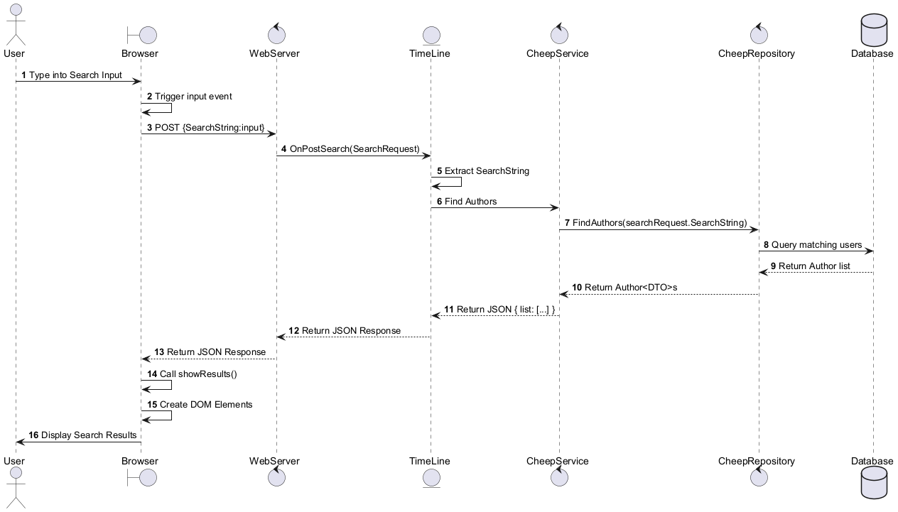

<!-- With a UML sequence diagram, illustrate the flow of messages and data through your Chirp! application. Start with an HTTP request that is send by an unauthorized user to the root endpoint of your application and end with the completely rendered web-page that is returned to the user.

Make sure that your illustration is complete. That is, likely for many of you there will be different kinds of "calls" and responses. Some HTTP calls and responses, some calls and responses in C\# and likely some more. (Note the previous sentence is vague on purpose. I want that you create a complete illustration. -->

UML sequence diagrams

\
The above diagram illustrates the flow of a user signing up for (or in to) our service. 
The user, upon navigating to the root endpoint, initiates an ``HTTP GET`` request which is processed by the web server. The server checks whether the user is authorized. 
Since the user is not yet authenticated, the server responds with an ``HTML`` page that displays an empty public timeline and a login button.

If the user chooses to log in, they interact with the login page by clicking the login button, which sends another ``HTTP GET`` request to the ``/login`` endpoint. The server responds by rendering the ``Login.cshtml`` Razor page, presenting the user with a form to either log in or register.

Once the user submits their credentials via the form, an ``HTTP POST`` request is sent to the ``/login`` endpoint. The web server validates the credentials. If authentication succeeds, the server redirects the user back to the public timeline view.

As an authenticated user, the browser sends another ``HTTP GET`` request to the root endpoint. This triggers the server to render the ``PublicTimeLine.cshtml`` Razor page by invoking the ``OnGetAsync()`` method. During this process, the PublicTimeLine component calls the ``CheepService`` to retrieve public messages and their count. The ``CheepService``, in turn, queries the ``CheepRepository``, which executes database queries to fetch the required data.

Once the database returns the list of *Cheeps* and their count, the information is passed back up through the service and controller layers to the ``PublicTimeLine`` component. The Razor page is rendered with the retrieved *Cheeps*, and an ``HTML`` response is returned to the browser. The user's browser then displays the fully rendered public timeline with the fetched *Cheeps*.\
\
\
\

\
When posting a cheep, a user would initiate the following flow.
Typing a post into the input field and pressing "Enter," the browser triggers an event to process the input. This sends an ``HTTP POST`` request with the form data to the web server. The server invokes the ``OnPostSave()`` method in the ``PublicTimeLine`` component to handle the post submission.

First, the post content is validated, and if an image is included, it is saved with a ``URL`` returned, designating the filepath of the stored image. The ``PublicTimeLine`` component then interacts with the ``CheepService`` to locate the author of the post. The ``CheepService`` queries the ``CheepRepository``, which fetches the author data from the database and returns it back up the chain.

With the author information, a new ``Cheep message`` is created and sent to the ``CheepRepository`` for saving in the database. Once the database confirms the save, the success response propagates back through the ``CheepService`` and ``PublicTimeLine`` component.

Finally, the server renders the updated ``PublicTimeLine.cshtml`` Razor page, including the new *Cheep*, and sends the ``HTML`` response to the browser. The browser then displays the updated timeline to the user with their newly posted message.
\
\
\

\
When using the search functionality, the browser immediately triggers an input event for each keystroke, as the user types into the search input field. This sends an ``HTTP POST`` request to the web server, containing the current search string. The server calls the ``OnPostSearch()`` method in the ``TimeLine`` component to handle the search.

The ``TimeLine`` component extracts the search string and interacts with the ``CheepService`` to find matching authors. The ``CheepService`` queries the ``CheepRepository``, which searches the database for users matching the input. The results are returned as a list of *Author* data objects, which are sent back to the browser in a ``JSON`` response.

Upon receiving the response, the browser dynamically calls the ``showResults()`` function, which creates and updates ``DOM`` elements to display the search results. This allows the user to see search results updating in real-time as they type, rather than having to complete a search and press Enter.
\
\
\

\
When a user presses the follow button on an authors page, the browser triggers an input event and sends an ``HTTP POST`` request to the web server, containing the usernames of the follower and the followee. The server invokes the ``OnPostFollow()`` method in the ``UserTimeLine`` component to handle the follow/unfollow action.

The ``UserTimeLine`` component calls the ``CheepService`` to retrieve both user profiles. The ``CheepService`` queries the ``CheepRepository``, which fetches the users' data from the database. Once the user data is returned, the service checks whether the initiating user *(Author A)* is already following the target user *(Author B)*.
- If *Author A* is not following *Author B*, the ``CheepService`` creates a follow relationship between the two users and saves it to the database.
- If *Author A* is already following *Author B*, the ``CheepService`` removes the follow relationship from the database.

Upon successful follow/unfollow, a response is propagated back through the ``CheepService`` and ``UserTimeLine`` component. The updated ``UserTimeLine.cshtml`` Razor page is rendered by the server and sent to the browser. The browser then displays the updated timeline, reflecting the user's changed follow/unfollow status dynamically.