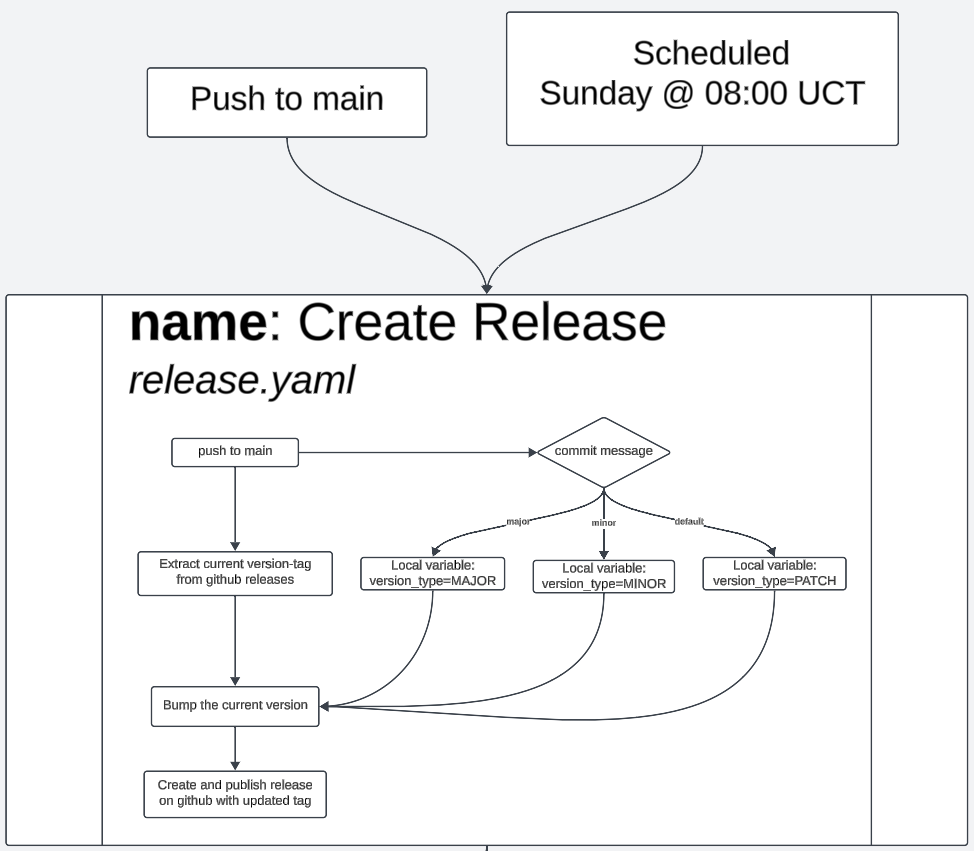

<!-- Illustrate with a UML activity diagram how your Chirp! applications are built, tested, released, and deployed. That is, illustrate the flow of activities in your respective GitHub Actions workflows. -->

<!-- Describe the illustration briefly, i.e., how your application is built, tested, released, and deployed. -->

# UML Activity Diagram for Chirp! Application

## Overview

The following describes the **UML activity diagrams** representing how the Chirp! application is **built**, **tested**, **released**, and **deployed** using **GitHub Actions** workflows.

The key activity of this project has been **automating mundane tasks**, which significantly decreases the accumulated workload and speeds up processes. Using **GitHub Actions**, the need for manually creating releases, generating DLLs, and deploying the service to Azure has been **eliminated**—excluding the time invested in creating these workflows.

While testing with **Playwright** caused some issues on GitHub, leading to skipped testing steps in workflows, the focus has been on maintaining and ensuring workflows function correctly. Code quality was considered less critical because **Git rollbacks** can revert any problematic changes.

### Key Workflow Triggers:
1. **Primary Trigger**: Push to the `main` branch (e.g., after an accepted pull request).
2. **Secondary Trigger**: A scheduled workflow run every **Sunday at 08:00 UTC**.

Once the **Create Release** workflow completes, it triggers two subsequent workflows:
- **Make DLL**
- **Build and Deploy**

---

## Creating a Release Workflow

### **Description**
The **Create Release** workflow triggers under two conditions:
1. **Push to `main`** branch.
2. **Scheduled run** on **Sunday at 08:00 UTC**.

### **Purpose**
The workflow **automates the creation of a new release** by:
- Scanning the **commit message** for keywords to determine the version bump.
- Following the **Major.Minor.Patch** versioning convention:
  - **Major**: Total rework of the system (e.g., switching from CLI to a web-based service).
  - **Minor**: New features added to the existing system.
  - **Patch**: Bug fixes, formatting changes, or refactors.

If the commit message includes:
- `Major`: The version bump will increment the **Major** version.
- `Minor`: The version bump will increment the **Minor** version.
- **Default**: If no keywords are detected, the version will default to a **Patch**.

### **Notes**:
- This workflow **previously contained a testing step**, but it was **removed** due to compatibility issues.

---

## Making DLLs Workflow

### **Description**
The **Make DLL** workflow builds the program and generates a **zip file** containing the `.dll` files for distribution.

### **Matrix Strategy**
- A **matrix** is used to optimize the step, specifically the **"Process for creating a zip file with .dll"**.
- The matrix reduces **code redundancy** and simplifies supporting multiple operating systems.
- If additional OS platforms need to be supported in the future, the matrix makes it easy to extend the workflow.

### **Workflow Steps**:
1. **Build the Program**:
   - The program is compiled to generate `.dll` files.
2. **Create a ZIP File**:
   - The DLLs are packaged into a zip file for easy distribution.
3. **Attach Files to the Latest Release**:
   - The zip file containing DLLs is appended to the **latest GitHub release** created by the **Create Release** workflow.

### **Dependency**:
- It is **crucial** that the **Create Release** workflow runs successfully before `Make DLL` starts.
- If no new release is created, this workflow may **overwrite the files** in the most recent release.

---

## Deploying to Production Workflow

### **Description**
The **Build and Deploy** workflow is based on a **template provided by Azure** and has been modified to integrate with the **Create Release** workflow.

### **Key Modifications**:
- The workflow waits for the **confirmation** of the **"test step"** (now deleted) from the **Create Release** workflow before proceeding.

### **Workflow Steps**:
1. **Setup Environment**:
   - Sets up the .NET environment to build the application.
2. **Build the Application**:
   - Compiles the application for deployment.
3. **Deploy to Azure**:
   - The compiled application artifacts are deployed to the Azure Web App.

---

## Summary of Automation Benefits

1. **Time Savings**: 
   - Manual tasks such as creating releases, generating DLLs, and deploying services are now fully automated.
2. **Scalability**:
   - The matrix strategy in the `Make DLL` workflow supports multiple operating systems efficiently.
3. **Simplified Workflow Management**:
   - By focusing on maintaining workflows, developers can roll back code if issues arise, ensuring stability.

---

## Diagrams

1. **Main Workflow Overview**  
   

2. **Create Release Workflow**  
   

3. **Make DLL Workflow**  
   

4. **Build and Deploy Workflow**  
   

---

