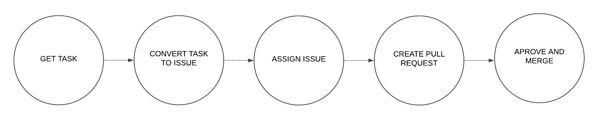

<!-- Show a screenshot of your project board right before hand-in. Briefly describe which tasks are still unresolved, i.e., which features are missing from your applications or which functionality is incomplete.

Briefly describe and illustrate the flow of activities that happen from the new creation of an issue (task description), over development, etc. until a feature is finally merged into the main branch of your repository. -->

### Project Board

<!--! last updated the 17 december -->

This is an image of the project board before submission. The only issue which is incomplete prior to submission, is the "Front-end filtering cheeps".
This issue refers to filtering what the user want to search by e.g. filter the search by email, author or cheep content.
This issue was not a requirement, but instead an idea for extending the search function.

### Process of Task to Implementation

Once given a task description, it is formulated into an issue. Once all tasks have been formulated into issues, they are then distributed to one or multiple contributors, depending on the assumed size of the issue.

Once the work on an issue has begun, the issue is moved from the `Todo` column to the `In Progress` column. 

When the assigned contributors have decided that the requirements for the issue has been met, they create a pull request and move it into the `In Review` column. This allows other developers to read and review the pull request. Once there are no conflicts, the pull request is then accepted and the issue is moved into the `In Prod` column.

The given code which satisfies the original task has now been merged into the **main** branch.
