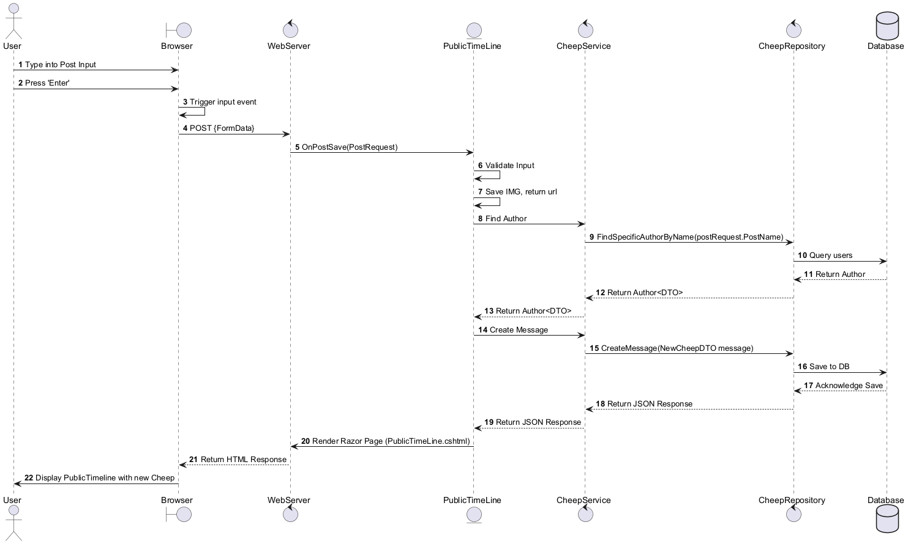
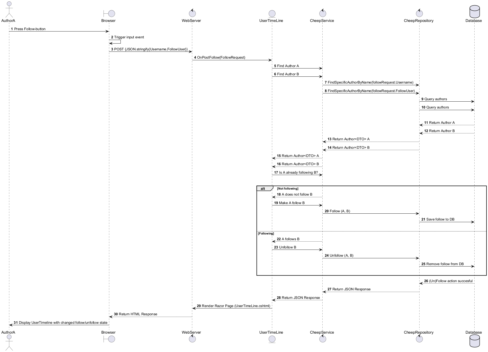
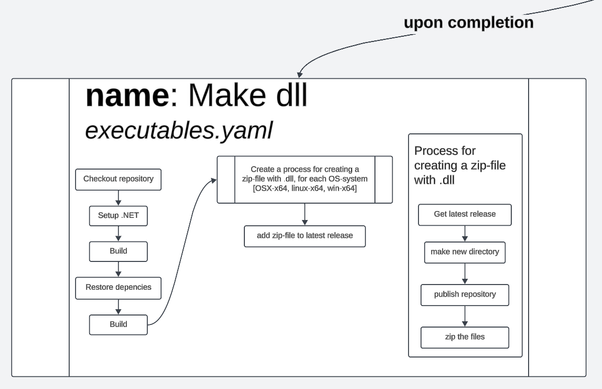

# Design and Architecture of *Chirp!*

## Domain model


<p style="text-align: center;">
    <b>Figure 1.1.1: Domain model</b>
</p>


The Domain for chirp is based off of two ***Entities***, and one superclass, `IdentityUser`, which ***Author*** extends. They derive attributes such as `id`, `username`, `email` and an encrypted password.

***Authors*** are the equivalent of application users. Apart from the extended attributes, ***Authors*** contain all ***Cheeps*** (messages), that they have written. They keep track of who they follow, who they are followed by, ***Cheeps*** they have liked, and ***Cheeps*** they have disliked.
They cannot both like and dislike a ***Cheep*** at the same time.
Two ***Authors*** cannot have the same case-insensitive username or email i.e. An ***Author*** cannot be named "helge", if "Helge" already exists. <!-- one of the Helges needs to be small h-->

***Cheeps*** are all the messages of the application.
***Cheeps*** are identified with a unique id.
They contain attributes, like text, an optional image, the time of posting, and their associated ***Author***.
They contain data for which ***Authors*** have liked or disliked.
They also contain a calculated float based on their amount of likes, which is used for sorting by relevance.

Additionally, the attribute `Text` in ***Cheep*** cannot contain more than 160 characters and they can only have a single ***Author***.


## Architecture — In the small
<!-- %Illustrate the organization of your code base. That is, illustrate which layers exist in your (onion) architecture. Make sure to illustrate which part of your code is residing in which layer. -->

### Design and architecture


<p style="text-align: center;">
    <b>Figure 1.2.1: Core diagram</b>
</p>

The `Chirp.Core` package contains the domain ***Entities*** and data transfer objects, for database transactions.

The `DTO`'s are split up into two groups, one for each ***Entity***.
In order to obtain the **SOLID principles** (Single responsibility, Open/closed, Liskov substitution, Interface segregation, and Dependency inversion). `DTO`'s are split up even further to strive for the single responsibility principle. Thus there is the `NewCheepDTO`, which is for sending data of new ***Cheeps*** into the database. The default `CheepDTO` is for reading ***Cheeps***, for showing on the timeline.
The `UpdateCheepDTO` is for editing existing ***Cheeps***, by changing their content.
Lastly, there is the `CheepDTOForRelevance` which is used for the relevance sorting algorithm.

For the ***Author***, two `DTO`'s have been made for either creating an ***Author*** or to get information on the ***Author*** from the database. 


<p style="text-align: center;">
    <b>Figure 1.2.2: Repository diagram</b>
</p>

The ***Chirp.Infrastructure.Repositories*** package, contains *classes* and *interfaces* regarding the database and *classes* which seed or query the database.

`AuthorRepository` and `CheepRepository` queries the database depending on whether ***Author*** or ***Cheep*** is the main ***Entity***.

The `CheepDBContext` defines the database ***Entities*** and the relations between them.

Both `AuthorRepository`, `CheepRepository` and `CheepDBContext` are dependency injected into the application.
This ensures one and only one instance of each.

The `DbInitializer` seeds the database with default ***Cheeps*** and ***Authors***. This makes it easier to make in-memory testing.

The static class `HelperFunctions` provides functionality to the `CheepRepository`. ***Cheeps*** contain `DateTime` and `DTO`'s should only store predefined types, `DateTime` needs to be converted to unixTime of type `long` and vice versa.


<p style="text-align: center;">
    <b>Figure 1.2.3: Service diagram</b>
</p>

The ***Chirp.Services*** package contains the `CheepService` class, which directly communicates with the page models.

The service transacts data between the *page models* and indirectly the database using the *repositories*.

`CheepService` contains the dependency injected `IAuthorRepository` and `ICheepRepository`.

The `CheepService` itself is also dependency, injected into the application. Page models refer to the same service, which refers to the same repositories, which refer to the same database.


<p style="text-align: center;">
    <b>Figure 1.2.4: Web diagram</b>
</p>

The ***Chirp.Web*** package contains all the pages, as well as the startup program.

The pages are made up of page models written in `C#` and the pages in `cshtml`.

The `cshtml` pages send requests to the model which are handled by reading or writing to the database using the application's associated *service interface*.

The scaffolded package ***Area.Identity.Page.Account*** is used to handle getting an identity token when logging in and managing the account using ***Microsoft.AspNet.Identity***'s IdentityUser.


<p style="text-align: center;">
    <b>Figure 1.2.5: Onion architecture</b>
</p>

The entire `Chirp` package fulfills the *onion architecture*. Since ***Chirp.Core*** does not need to refer to any of the outer layers. The same goes for the *repository layer* and the *service layer*.


<!-- Illustrate the architecture of your deployed application. Remember, you developed a client-server application. Illustrate the server component and to where it is deployed, illustrate a client component, and show how these communicate with each other. -->


<p style="text-align: center;">
    <b>Figure 1.3.1: New User</b>
</p>

\
This diagram illustrates the *architecture of the Chirp application* as well as the interaction between its key components. The system is divided into three main layers: *the Client, the Server, and the Database*, all hosted within the *Azure* environment.

- **Client Layer**: The user interacts with the application using a web browser. When the user enters a `URL` or performs an action, the browser sends `HTTP` requests to the server. The browser receives responses in the form of `HTML`, `CSS`, and `JavaScript`, which it uses to render and display the user interface.  

- **Server Layer**: Hosted on the *Azure App Service*, the server is made up of two primary components: *the Web Server* and *the Application Logic*. The web server handles incoming `HTTP` requests from the *client* and *routes* them to the appropriate *application logic*. This logic processes the request and then queries the database for data or updates if necessary.  

- **Database Layer**: The database is integrated into the *Azure* ecosystem and stores all the application data. This includes user information, *Cheeps*, and *relationships*. It responds to queries from the application logic with the requested data or confirms successful updates.

The flow begins when a user interacts with the browser (e.g., entering a `URL`). The browser sends a request to the *web server*, which processes the request and interacts with the *application logic*.
The database returns the required information, which is processed and formatted by the *application logic* and *web server* before being sent back to the client as an `HTTP` response. The browser then renders the returned content and updates the *user interface* accordingly.

<!-- % Illustrate typical scenarios of a user journey through your Chirp! application. That is, start illustrating the first page that is presented to a non-authorized user, illustrate what a non-authorized user can do with your Chirp! application, and finally illustrate what a user can do after authentication.

% Make sure that the illustrations are in line with the actual behavior of your application. -->

# Useractivity 
When it comes to *webdevelopment*, the overall *userexperience* and functionality of the website is crucial. Giving the user access to the functions of the website while also maintaining the safety of the website, can end up being one of the more important aspects of *webdevelopment*.

The sitemap in figure 1.4.1, contains most of the traversal possibilities for a user, when logged in and logged out, to illustrate the user's accessibility in different parts of the website and the general structure of the website. 
*- Notice: To understand the elements in the sitemap, it is recomended to first have a general understanding of the definitions of colors and arrows in the bottom part of figure 1.4.1.*


<p style="text-align: center;">
    <b>Figure 1.4.1: sitemap</b>
</p>


### Logged out
When a user is logged out, they do not have the same accessibility as a user who is logged in. Their access is very limited, and it only allows the user to log in or register. Any references to the websites structure in this chapter, will be directed towards the illustration in figure *1.4.2*


<p style="text-align: center;">
    <b>Figure 1.4.2: Logged out</b>
</p>
</img>

#### Github login/register
When a user enters the website, they will see the front page without content. To view any content, the user must press the "Log in" button, which will lead them to the "Log in"-page. From here the user can choose to use an external login to access the website. The external login uses the *GitHub Authorization* process giving the website a token, which allows the website to access the information about the *github user*.  

If the user exists within the database, the user is logged in and is now able to access the application with all of its functionalities. If a user does not exist, the user's *Github User ID* becomes the username and they are registered as a new user.

#### Normal login/register
As shown in figure 1.4.2 to log in, without an external login, to the website, a user must write their email and password of their account. If they do not exist in the database, an error message will be sent back to inform the user that the log in process has failed. If it succeeds, the user will be given access.

However if a user does not have an account, the user can access the register-page, where they are prompted to enter their email, username and password. If the information does not already exist within the database, the user will be registered as a new user and be given authentication, and be authorized to see *Cheeps* and post *Cheeps*. But should the information already exists, the person will be given an error message, informing the user that the information is already in use.

### Logged in
When a user is logged in,y have full authorization to the website, which includes both functions and content. Most of the interactability is present on the front page. References to the websites structure in this section, will be directed towards the illustration in figure *1.4.3*

<p style="text-align: center;">
    <b>Figure 1.4.3: Logged in</b>
</p>

#### Main page
##### Cheeps
As seen in *figure 1.4.3* under *Cheeps* a user can read and then like or dislike a *Cheep*.
From the *Cheep*, a user can access the *Author*'s page and timeline as well as see who liked or disliked the *Cheep*.

##### My Timeline
The user's timeline displays the user's own *Cheeps*, and the *Cheeps* posted by who they follow.

##### Post and Search
The search function searches the database for *Authors* When searching, the user is presented with a textfield, which will find possible search results for any given *Author* which matches the content of the search-bar. The results of *Authors* that are returned can be clicked, which redirects to the *Author*'s timeline. 

The `Post` function as seen in *figure 1.4.3* has two elements; a *textfield* and a *file button*. The *textfield* can be filled out by the user. The *file button*, allows the user to choose a picture from their own computer, which will then be included in their *Cheep*, along with the text.

##### Filter
As seen in *figure 1.4.3* a user can choose to check out popular *Cheeps* by pressing the option *MostLiked*. This filters the *Cheeps* in a descending order with the most liked *Cheep* being at the top. Other options such as *Newest* or *Oldest* will order the *Cheeps* based on time. The *Relevance* option in the filter will give you a order based on time, however the *Cheeps* shown, will be *relevant* - which means *Cheeps* from the user's following and liked *Cheeps*.

#### Profile
To explore the user's account and their own information, the user can click on their profile picture. This displays a new page with the user's *My Page* and *Settings*. References to the websites structure in this section, will be directed towards the illustration in figure *1.4.4*


<p style="text-align: center;">
    <b>Figure 1.4.4: Profile</b>
</p>

##### My Page
The *My Page* element, when accessing the profile, redirects the user to the user's *My Page*. Within this page is most of the relevant information of the user, such as email, username and the amount of followers and amount of people that the user follows. The user can access a page with a list for all the users that they follow, and a list of all the users that follow them. Moreover, the *My Page* also has other functionalities and information, such as the *Forget Me* option, which the user can choose, when looking at the overall sitemap in figure *1.4.1*, to delete all their information. The *Help* includes a basic guide on how to use the **Chirp** website.
 
##### Settings
The *Settings* button allows the user to see a more detailed view of their *account information*.
By looking at figure *1.4.4* the *Settings* page contains more options than the user's *My Page*.
On the *profile page* the user can view their account info such as the username or register a telephone number. Other elements such as *Password*, gives the user the ability to change their password. 
If the user wanted to link an external login to their user, they can navigate to *External Logins* where they are able to link their github account to their Chirp account.
If the user wishes additional safety measures for their account, they can navigate to the 2-factor authentication, which will allow the user to link an authentication app.
The *Personal Data* allows the user to download their data from the Chirp website.
<!-- With a UML sequence diagram, illustrate the flow of messages and data through your Chirp! application. Start with an HTTP request that is send by an unauthorized user to the root endpoint of your application and end with the completely rendered web-page that is returned to the user.

Make sure that your illustration is complete. That is, likely for many of you there will be different kinds of "calls" and responses. Some HTTP calls and responses, some calls and responses in C\# and likely some more. (Note the previous sentence is vague on purpose. I want that you create a complete illustration. -->

### Flow of new user


<p style="text-align: center;">
    <b>Figure 1.5.1: New User</b>
</p>

\
The diagram above illustrates the flow of a user signing up or in to the Cheep service. 
The user, upon navigating to the root endpoint, initiates an `HTTP GET` request which is processed by the *web server*. The server checks if the user is authorized. 
Since the user is not yet authenticated, the server responds with an `HTML` page that displays an empty public timeline and a login button.

If the user logs in, they interact with the login page by clicking the login button, which sends another `HTTP GET` request to the `/login` endpoint. The server responds by rendering the *Login.cshtml* Razor page, presenting the user with a form to either log in or register.

Once the user submits their credentials through the form, an `HTTP POST` request is sent to the `/login` endpoint. The web server validates the credentials. If authentication succeeds, the server redirects the user back to the public timeline view.

As an authenticated user, the browser sends another `HTTP GET` request to the root endpoint. This triggers the server to render the *PublicTimeLine.cshtml* Razor page by invoking the `OnGetAsync()` method. During this process, the PublicTimeLine component calls the `CheepService` to retrieve public messages and their count. The `CheepService`, in turn, queries the `CheepRepository`, which executes database queries to fetch the required data.

Once the database returns the list of *Cheeps* and the count, the information is passed back to the *service* and *controller layers* to the `PublicTimeLine` component. The Razor page is rendered with the retrieved *Cheeps*, and an `HTML` response is returned to the browser. The user's browser then displays the fully rendered public timeline with the fetched *Cheeps*.\
## Sequence of functionality/calls through *Chirp!*

<p style="text-align: center;">
    <b>Figure 1.5.2: Post Cheep</b>
</p>

When posting a cheep, a user would initiate the following flow.
Typing a post into the input field and pressing "Enter," the browser triggers an event to process the input. This sends an `HTTP POST` request with the form data to the web server. The server invokes the `OnPostSave()` method in the `PublicTimeLine` component to handle the post submission.

Firstly, the post content is validated, and if an image is included, it is saved with a `URL`, designated to the filepath of the stored image. The `PublicTimeLine` component then interacts with the `CheepService` to locate the author of the post. The `CheepService` queries the `CheepRepository`, which fetches the author data from the database.

With the author information, a new `Cheep message` is created and sent to the `CheepRepository` and is stored in the database. Once the database confirms the save, the success response propagates back through the `CheepService` and `PublicTimeLine` component.

Finally, the server renders the updated `PublicTimeLine.cshtml` Razor page, including the new *Cheep*, and sends the `HTML` response to the browser. The browser then displays the updated timeline to the user with their new message.
\
\
\

<p style="text-align: center;">
    <b>Figure 1.5.3: Search</b>
</p>
\
When using the search functionality, the browser triggers an input event for each keystroke, as the user types into the search input field. This sends an `HTTP POST` request to the web server, containing the current search string. The server calls the `OnPostSearch()` method in the `TimeLine` component to handle the search.

The `TimeLine` component extracts the *search string* and interacts with the `CheepService` to find matching authors. The `CheepService` queries the `CheepRepository`, which searches the database for users matching the input. The results are returned as a list of *Author* data objects, which are sent back to the browser in a `JSON` response.

Upon receiving the response, the browser dynamically calls the `showResults()` function, which creates and updates `DOM` (Document Object Model) elements to display the search results. This allows the user to see search results updating in real-time as they type, rather than having to complete a search and press Enter.
\
\
\

<p style="text-align: center;">
    <b>Figure 1.5.4: Follow Action</b>
</p>
\
When a user presses the *follow button* on an *authors page*, the browser triggers an input event and sends an `HTTP POST` request to the web server, containing the usernames of the follower and the followee. The server invokes the `OnPostFollow()` method in the `UserTimeLine` component to handle the follow and unfollow actions.

The `UserTimeLine` component calls the `CheepService` to retrieve both user profiles. The `CheepService` queries the `CheepRepository`, which fetches the users' data from the database. Once the user data is returned, the service checks whether the initiating user *(Author A)* is already following the target user *(Author B)*.
- If *Author A* is not following *Author B*, the `CheepService` creates a follow relationship between the two users and stores it in the database.
- If *Author A* is already following *Author B*, the `CheepService` removes the follow relationship from the database.

Upon a successful follow or unfollow, a response is propagated back through the `CheepService` and `UserTimeLine` component. The updated `UserTimeLine.cshtml` Razor page is rendered by the server and sent to the browser. The browser then displays the updated timeline, reflecting the user's changed follow or unfollow status dynamically.


<!-- Illustrate with a UML activity diagram how your Chirp! applications are built, tested, released, and deployed. That is, illustrate the flow of activities in your respective GitHub Actions workflows. -->

<!-- Describe the illustration briefly, i.e., how your application is built, tested, released, and deployed. -->

# UML Activity Diagram for Chirp! Application

## Overview

The following describes the **UML activity diagrams** representing how the Chirp! application is **built**, **tested**, **released**, and **deployed** using **GitHub Actions** workflows.

The key activity of this project has been **automating mundane tasks**, which significantly decreases the accumulated workload and speeds up processes. Using **GitHub Actions**, the need for manually creating releases, generating DLLs, and deploying the service to Azure has been **eliminated**—excluding the time invested in creating these workflows.

While testing with **Playwright** caused some issues on GitHub, leading to skipped testing steps in workflows, the focus has been on maintaining and ensuring workflows function correctly. Code quality was considered less critical because **Git rollbacks** can revert any problematic changes.

### Key Workflow Triggers:
1. **Primary Trigger**: Push to the **main** branch (e.g., after an accepted pull request).
2. **Secondary Trigger**: A scheduled workflow run every **Sunday at 08:00 UTC**.

Once the **Create Release** workflow completes, it triggers two subsequent workflows:
- **Make DLL**
- **Build and Deploy**

---

## Creating a Release Workflow


<p style="text-align: center;">
    <b>Figure 2.1.1: Create release workflow</b>
</p>

### **Description**
The **Create Release** workflow triggers under two conditions:
1. **Push to `main`** branch.
2. **Scheduled run** on **Sunday at 08:00 UTC**.

### **Purpose**
The workflow **automates the creation of a new release** by:
- Scanning the **commit message** for keywords to determine the version bump.
- Following the **Major.Minor.Patch** versioning convention:
  - **Major**: Total rework of the system (e.g., switching from CLI to a web-based service).
  - **Minor**: New features added to the existing system.
  - **Patch**: Bug fixes, formatting changes, or refactors.

If the commit message includes:
- `Major`: The version bump will increment the **Major** version.
- `Minor`: The version bump will increment the **Minor** version.
- **Default**: If no keywords are detected, the version will default to a **Patch**.

### **Notes**:
- This workflow **previously contained a testing step**, but it was **removed** due to compatibility issues.

---

## Making DLLs Workflow


<p style="text-align: center;">
    <b>Figure 2.1.2: Make DLL workflow</b>
</p>

### **Description**
The **Make DLL** workflow builds the program and generates a **zip file** containing the `.dll` files for distribution.

### **Matrix Strategy**
- A **matrix** is used to optimize the step, specifically the **"Process for creating a zip file with .dll"**.
- The matrix reduces **code redundancy** and simplifies supporting multiple operating systems.
- If additional OS platforms need to be supported in the future, the matrix makes it easy to extend the workflow.

### **Workflow Steps**:
1. **Build the Program**:
   - The program is compiled to generate `.dll` files.
2. **Create a ZIP File**:
   - The DLLs are packaged into a zip file for easy distribution.
3. **Attach Files to the Latest Release**:
   - The zip file containing DLLs is appended to the **latest GitHub release** created by the **Create Release** workflow.

### **Dependency**:
- It is **crucial** that the **Create Release** workflow runs successfully before `Make DLL` starts.
- If no new release is created, this workflow may **overwrite the files** in the most recent release.

---

## Deploying to Production Workflow


<p style="text-align: center;">
    <b>Figure 2.1.3: Build and deploy workflow</b>
</p>

### **Description**
The **Build and Deploy** workflow is based on a **template provided by Azure** and has been modified to integrate with the **Create Release** workflow.

### **Key Modifications**:
- The workflow waits for the **confirmation** of the **"test step"** (now deleted) from the **Create Release** workflow before proceeding.

### **Workflow Steps**:
1. **Setup Environment**:
   - Sets up the .NET environment to build the application.
2. **Build the Application**:
   - Compiles the application for deployment.
3. **Deploy to Azure**:
   - The compiled application artifacts are deployed to the Azure Web App.

---

## Summary of Automation Benefits

1. **Time Savings**: 
   - Manual tasks such as creating releases, generating DLLs, and deploying services are now fully automated.
2. **Scalability**:
   - The matrix strategy in the `Make DLL` workflow supports multiple operating systems efficiently.
3. **Simplified Workflow Management**:
   - By focusing on maintaining workflows, developers can roll back code if issues arise, ensuring stability.

## Team work
<!-- Show a screenshot of your project board right before hand-in. Briefly describe which tasks are still unresolved, i.e., which features are missing from your applications or which functionality is incomplete.

Briefly describe and illustrate the flow of activities that happen from the new creation of an issue (task description), over development, etc. until a feature is finally merged into the main branch of your repository. -->

### Project Board


<p style="text-align: center;">
    <b>Figure 2.2.1: Project board</b>
</p>

<!--! last updated the 17 december -->

This is an image of the *project board* before submission. The only issue which is incomplete prior to submission, is the "Front-end filtering cheeps".
This issue refers to filtering what the user want to search by e.g. filter the search by email, author or cheep content.
This issue was not a requirement, but instead an idea for extending the search function.

### Process of Task to Implementation


<p style="text-align: center;">
    <b>Figure 2.2.2: Task to in main branch</b>
</p>

Once given a task description, it is formulated into an *issue*. Once all tasks have been formulated into *issues*, they are then distributed to one or multiple contributors, depending on the assumed size of the issue.

Once the work on an issue has begun, the issue is moved from the `Todo` column to the `In Progress` column. 

When the assigned contributors have decided that the requirements for the issue has been met, they create a pull request and move it into the `In Review` column. This allows other developers to read and review the pull request. Once there are no conflicts, the pull request is then accepted and the issue is moved into the `In Prod` column.

The given code which satisfies the original task has now been merged into the **main** branch.


## How to make *Chirp!* work locally
<!-- There has to be some documentation on how to come from cloning your project to a running system. That is, Adrian or Helge have to know precisely what to do in which order. Likely, it is best to describe how we clone your project, which commands we have to execute, and what we are supposed to see then. -->

## Comprehensive guide to run the program locally

Please make sure you have all the right ***.Net 8*** dependencies installed [here](https://dotnet.microsoft.com/en-us/download/dotnet/8.0).

### How to start the project on localhost via releases

1. Download the newest release for your operating system [here](https://github.com/ITU-BDSA2024-GROUP13/Chirp/releases).  

2. Unzip the file, and navigate to the folder.  

3. Run `$ dotnet Chirp.Web.dll `  

4. Look in your terminal for which port the project is listening on. e.g.  

<p style="text-align: center;">
    <b>Figure 2.3.1: Local host</b>
</p>

5. Open your browser and type `http://localhost:<port>`  

### How to start the project via cloning the repository

1. Open your terminal and type `$ cd`

2. Clone the repository and type `$ git clone https://github.com/ITU-BDSA2024-GROUP13/Chirp.git`

3. Type `$ cd ./Chirp`

4. Run the program `$ dotnet watch --project ./src/Chirp.Web`

5. Look in your terminal for which port the project is listening on. e.g.  

<p style="text-align: center;">
    <b>Figure 2.3.2: Local host</b>
</p>

6. Open your browser and type `http://localhost:<port>`  


## How to run test suite locally
<!-- List all necessary steps that Adrian or Helge have to perform to execute your test suites. Here, you can assume that we already cloned your repository in the step above.

Briefly describe what kinds of tests you have in your test suites and what they are testing.-->


<p style="text-align: center;">
    <b>Figure 2.4.1: Code coverage report, using coverlet</b>
</p>


The ***test*** package tests all the ***infrastructure*** and ***core*** using unit tests and integration tests.

The `web` package is tested via end-to-end tests using Playwright. Playwright does not provide code coverage.


In order to run the ***infrastructure*** and ***core*** tests:

go to the `Chirp\test` folder in your terminal.

Write `dotnet test` in your terminal to run all tests except Playwright tests. 

If you want to see code coverage. Run `dotnet test /p:CollectCoverage=true /p:CoverletOutputFormat=lcov /p:CoverletOutput=lcov.info`

This should cover three packages: ***Chirp.Core***, ***Chirp.Repositories*** and ***Chirp.Services***.

In order to run the Playwright test, you have to:

#### Install the right dependencies
Make sure you have Node.js and npm (Node Package Manager) installed and/or updated.
You can install Node.js from their website [Node.js](https://nodejs.org/en).


1. **update npm in a powershell terminal at the root of your pc** 
```bash
$ npm install -g npm
```

2. **Verify you have them installed**
```bash
$ node -v
$ npm -v
```

3. **Install playwright package**
```bash
$ npm install -g playwright
```

4. **Move to Playwright folder**
```bash
$ cd ./testPlaywright/PlaywrightTests
```

5. **Install the Playwright Script**
```bash
$ pwsh .\bin\Debug\net8.0\playwright.ps1 install
```

6. ***In a new terminal*, start a server on the root folder in `Chirp`**
```bash
$ dotnet watch --project ./src/Chirp.Web
```

7. ***In the first terminal***
```bash
$ dotnet test
```

Once playwright is correctly installed you can go to the root folder of Chirp and write `dotnet test`. This will run all tests in the project.

## Test suites

There are 8 test suites each focusing on different aspects of the solution. Following the **onion-architecture** allows the tests to focus on each layer individually using testing types such as *unit tests*, isolate a chain of method calls for *Integration testing* and *End-to-End (E2E) Testing*.

| Test File                                                                | Unit Tests | Integration Tests | E2E Tests |
|--------------------------------------------------------------------------|------------|-------------------|-----------|
| [AuthorTest.cs](#authortests)                                | yes        | no                | no        |
| [AuthorRepositoryTests.cs](#authorrepositorytests) | yes        | yes               | no        |
| [CheepDBContextTest.cs](#cheepdbcontexttest)          | no         | yes               | no        |
| [CheepRepositoryTests.cs](#cheeprepositorytests)    | yes        | yes               | no        |
| [HelperFunctionsTests.cs](#helperfunctionstests)    | yes        | no                | no        |
| [CheepServiceTest.cs](#cheepservicetest)                | yes        | yes               | no        |
| [AzureTests.cs](#azuretests)                                  | no         | no                | yes       |
| [LocalTests.cs](#localtests)                                  | no         | no                | yes       |

Tabel 1: List of the test suites and their types of testing

## What is tested?

#### AuthorTests
>Focus: Validation of the Author datatype and its behavior.

##### Types of Testing
**Unit tests:**
- Property validations on the behavior of the `Author` datatype such as its required fields.


#### AuthorRepositoryTests
>Focus: Verifying the behavior of the repository pattern for Author.

##### Types of Testing
**Unit Tests:**
- Tests focused on individual repository methods like adding, retrieving updating and deleting authors.

**Integration Tests:**
- Tests that validate repository methods against an in-memory database

#### CheepDBContextTest
>Focus: Validating the setup and functionality of the database context.

##### Types of Testing
**Integration Tests:**
- Tests that involve actual database interactions, such as adding, retrieving updating and deleting authors, seeding and relationship checks.

*Examples:*
- Testing `CheepDBContext` initialization.
- Seeding the database correctly.
- Validating migrations and Schema enforcements.

#### CheepRepositoryTests
>Focus: Validating repository methods for managing Cheep ***Entities***.

##### Types of Testing
**Unit Tests:**
- Focused on verifying the behavior of repository methods like querying, filtering, or updating cheeps.

**Integration Test:**
- Tests repository functionality against an a seeded mock database to ensure correctness with real data structures.

#### HelperFunctionsTests
>Focus: Testing utility methods and reusable logic across the application.

##### Types of Testing
**Unit Tests:**
- Validates individual utility functions for correctness.

*Examples:*
- Converting a unix-timestamp to a date in string.
- Ensuring correct date formatting.

#### CheepServiceTest
>Focus: Testing the business logic for cheeps at the service level.

##### Types of Testing
**Unit Tests:**
- Focus on the correctness of service methods with mocked dependencies.

*Examples:*
- Input validation.
- Business rules (e.g., maximum length)

**Integration Tests:**
- Test the interaction of the `CheepService` with the repository and database.

#### AzureTests
>Focus: End-to-end testing (E2E) on a live Azure-hosted application.

##### Types of Testing
**E2E Tests:**
- These validate the full application behavior in a live Azure environment, including user login, navigation, and interaction with web elements.

*Examples:*
- `LoginTest`
- `LoginChanges`
- `LogOut`

#### LocalTests
>Focus: Testing the application on a local development server.

##### Types of Testing
**E2E Tests:**
- Simulates user interactions with the application through Playwright.

*Examples:*
- `LocalLogin`
- `LocalLoginChanges`
- `LocalLogOut`
- `LocalShowingCheeps`
- `LocalNavItems`


# Ethics

## License

This project is licensed under the **MIT license**. 
The **MIT license** was chosen on the basis that all of the other libraries used in this project are also under the **MIT license**, or are other open-sourced projects.
Moreover, this project was solely made for academic purposes. Therefore, if any of this code would aid any others, although unlikely, there would be no reason to prohibit it.

## LLMs, ChatGPT, CoPilot, and others
<!-- State which LLM(s) were used during development of your project.
In case you were not using any, just state so.
In case you were using an LLM to support your development, briefly describe when and how it was applied.
Reflect in writing to which degree the responses of the LLM were helpful.
Discuss briefly if application of LLMs sped up your development or if the contrary was the case. -->


The *Large Language Models* (LLMs) which were used throughout the development process were: **ChatGPT**, **GitHub CoPilot** and **Codium**.


All three LLMs were used primarily for debugging. 
For the generation of most of the documentation, it was only **ChatGPT** which was used.

As a rule, whenever any of the LLMs generated any code which was used, it was co-authored in the commit where that piece of code was included.
If an LLM was used simply for sparring to find the root cause of a bug, it was not included in the co-author message, unless it provided code to solve the bug.

In terms of the value of their responses, it varied. Sometimes, it was a small human error which was overseen, and the LLM helped discover it.
In other more complex cases, it required a greater understanding of the code base which the LLMs, especially **ChatGPT** lacked. In these situations, the LLMs which are built in to the text editors, **GitHub** **CoPilot** and **Codium**, were able to gather more information, but were still not always able to solve errors.
This may have lead to some spirals throughout the development process, of over-relying on an LLM to find a solution, taking a longer time to solve the problem.
